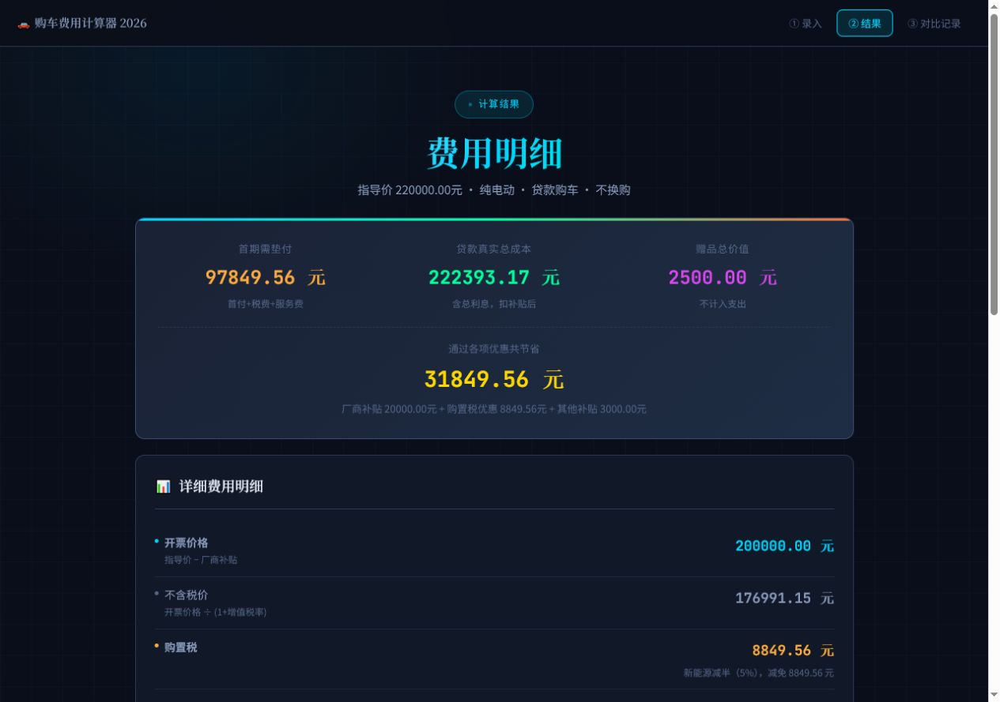
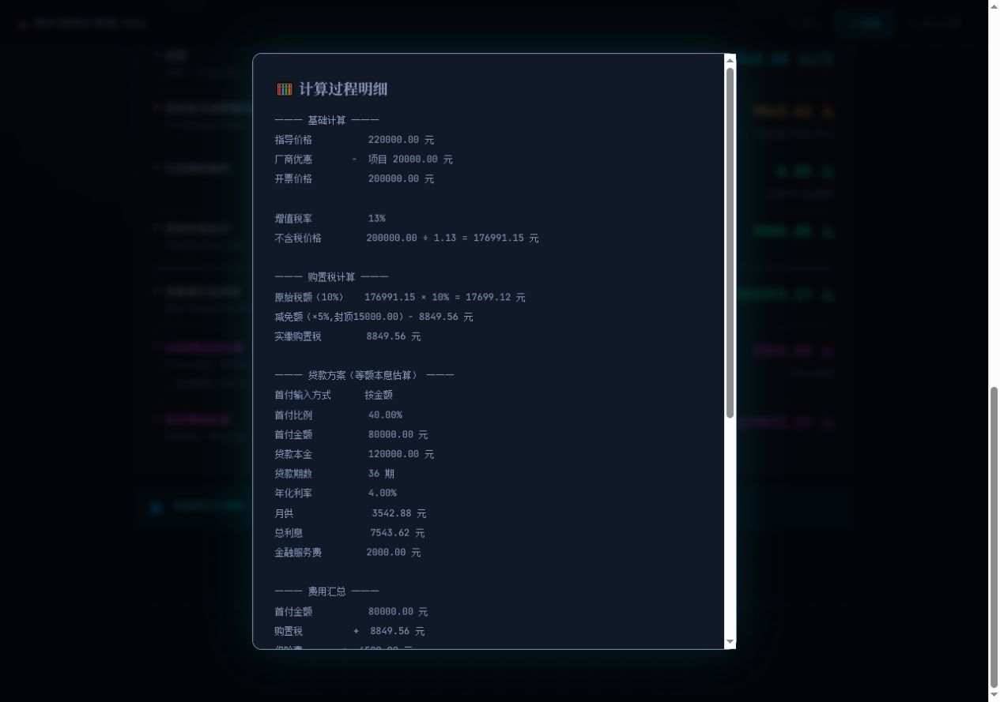
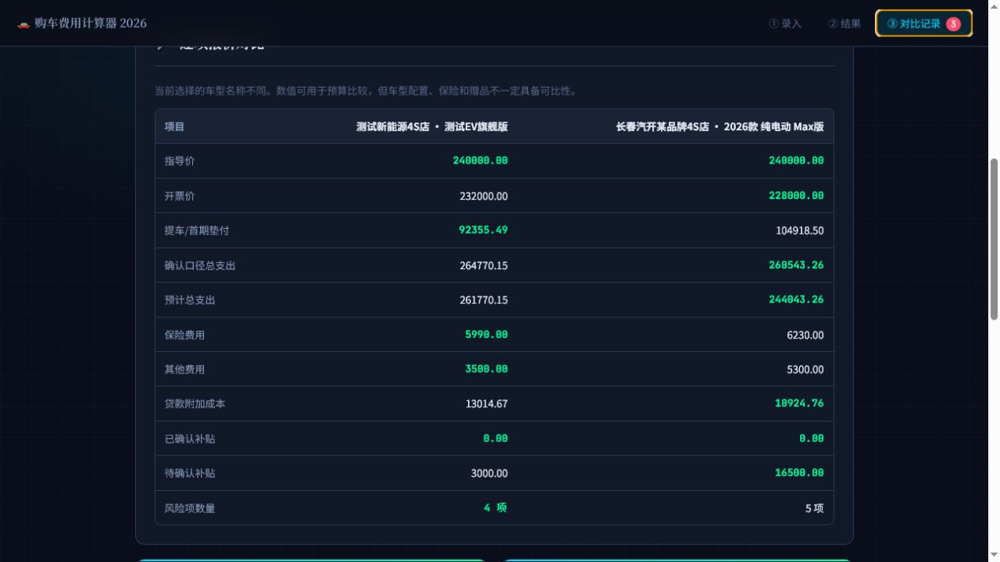
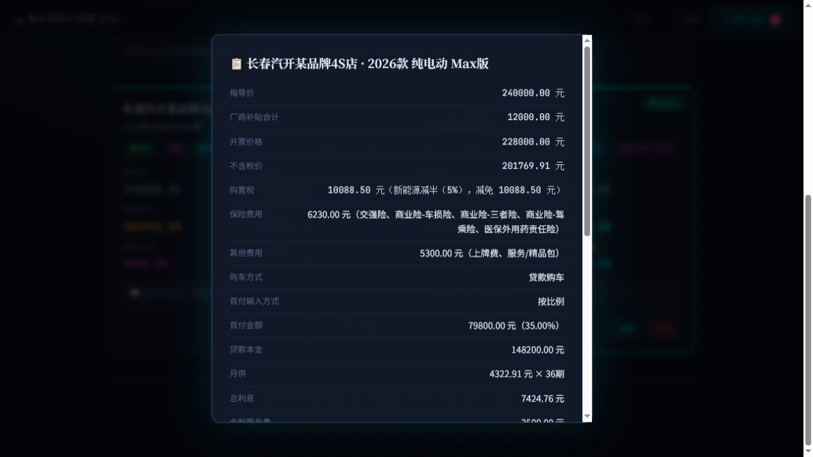

# 购车费用全维度计算器


一个面向真实看车场景的购车落地价计算和多店报价对比工具。它把销售口头报价里容易混在一起的项目拆开：指导价、厂商优惠、开票价、不含税价、购置税、保险/上牌等其他费用、以旧换新补贴、地方补贴、赠品估值，最后输出“提车时需垫付”“实际总支出”“综合等效支出”等结果。

> 政策和费用口径会随地区、时间、车型目录、发票开具方式变化。本工具用于辅助核算和比价，不替代政府公告、税务机关、商务主管部门、经销商合同和最终发票。

## 在线体验

在线版本：

<https://ganghaosun.github.io/car-buying-calculator/>

## 为什么做这个工具

最近准备买车时，我发现线下看车时常见的报价方式很不透明：销售会拿纸笔把裸车价、优惠、保险、上牌、购置税、置换补贴、赠品写在一起算一个“最终价格”。用户很难快速判断：

- 优惠到底是直接减开票价，还是后返补贴；
- 购置税的计税基础为什么不是指导价本身；
- 国补、地方补贴、厂商补贴能不能叠加；
- 提车当天真正要垫付多少钱；
- 不同 4S 店报价到底谁更划算；
- 赠品价值是否应该计入实际支出。

这个项目的目标不是做一个“报价单美化器”，而是把每一项费用拆成清晰、可核算、可横向比较的结构，让买车时不被一个总价带着走。

## 界面截图

### 录入报价首页


### 贷款首付设置


### 保险费用拆分


### 费用明细与贷款真实总成本



### 贷款现金流与长期持有成本


### 风险提示与报价报告导出


### 计算过程公示



### 保存报价记录


### 多店报价对比与导入导出


### 逐项报价差异对比



### 报价记录详情



### 手机端录入


### 手机端结果


## 已实现功能

- 基础价格录入：官方指导价、增值税率。
- 厂商优惠拆分：支持添加多个现金优惠/厂家补贴项目。
- 购置税计算：按开票价剥离增值税后计算计税基础。
- 新能源购置税优惠提示：支持新能源车型，并提示 2026-2027 年插混/增程技术门槛需以官方目录为准。
- 燃油车排量区分：支持 2.0L 及以下、2.0L 以上口径。
- 以旧换新补贴：支持不参与、报废更新、置换更新。
- 旧车资格校验：按旧车类型和注册日期提示是否满足报废更新条件。
- 保险费用拆分：支持交强险、车船税、车损险、三者险、驾乘险、医保外用药责任险和自定义保险项。
- 其他费用：上牌费、服务/精品包等非保险费用可以单独录入。
- 其他补贴：地方补贴、市级补贴、区级补贴等可以单独录入。
- 赠品估值：免费保养、贴膜、充电桩等不计入实际支出，但用于综合对比。
- 贷款购车计算：支持首付比例或首付金额二选一、等额本息、等额本金、金融附加费、提前结清期数、违约金比例、月度还款计划和贷款真实总成本。
- 贷款方案对比：同一报价可横向比较全款、等额本息和等额本金，并显示首期垫付、首月月供、总利息、金融附加费和预计总支出。
- 补贴确认分层：其他补贴可标记为已确认、待申请/有条件或销售口头承诺，分别计算“确认口径总支出”和“预计总支出”。
- 长期持有成本：支持 3 年或 5 年测算，录入年里程、能源成本、续保、保养和预计残值，输出年均和总持有成本。
- 报价链接分享：在不经过服务器的前提下，将当前报价编码到 URL 片段中，接收方打开链接即可查看结果。
- 计算过程展示：可查看每一步公式和中间值。
- 费用构成图：在结果页用条形图展示开票价、购置税、保险、其他费用、贷款成本、补贴抵扣和赠品估值。
- 报价风险提示：自动提示保险漏填、其他费用偏高、贷款附加成本偏高、后返补贴、赠品估值和新能源目录核验等风险。
- 报价报告导出：支持导出 HTML 报价报告，可用浏览器打印或另存为 PDF。
- 结果摘要分享：支持复制或调用浏览器原生分享，把报价摘要发给家人朋友讨论。
- 本地保存报价：把多家 4S 店报价保存到浏览器本地。
- 报价导入/导出：支持完整 JSON 备份导入导出，并可导出 CSV 表格用于查看。
- 多店横向对比：自动标记最低预计成本，生成多店成本图，并支持最多 4 条报价逐项对比；不同车型会给出可比性提示。
- 政策参数外部化：购置税、补贴比例、补贴封顶值、旧车注册时间、政策版本、有效期和核验日期集中在 `data/policy.json` 中；支持导入带来源和有效期的城市政策包。
- 真实计算引擎测试：页面和 Node.js 测试共同使用 `src/quote-engine.js`，覆盖购置税、补贴分层、贷款方案、提前结清、长期成本、风险提示和政策配置校验。
- GitHub Actions：每次提交到 `main` 或 Pull Request 自动运行 `npm test`。
- PWA 支持：包含 `manifest.json` 和 `sw.js`，部署到 HTTPS 后可添加到手机桌面。

## 核心计算口径

### 1. 开票价

```text
开票价 = 官方指导价 - 厂商优惠合计
```

这里的“厂商优惠”按直接影响发票金额处理。如果实际优惠是提车后返现或地方补贴，不建议填在这里，应填到“其他补贴”。

### 2. 不含税价

```text
不含税价 = 开票价 ÷ (1 + 增值税率)
```

默认增值税率为 13%，可手动调整。购置税通常不是直接用含税价乘 10%，而是以不含增值税的计税价格作为基础。

### 3. 购置税

燃油车：

```text
购置税 = 不含税价 × 10%
```

新能源车在当前页面中按 2026-2027 年“减半并设置单车减免上限”的思路计算：

```text
原始购置税 = 不含税价 × 10%
减免额 = min(不含税价 × 5%, 15000)
实缴购置税 = 原始购置税 - 减免额
```

不同车型是否进入《减免车辆购置税的新能源汽车车型目录》，以及插混/增程车型技术门槛，应以工信部等主管部门最新目录和公告为准。

### 4. 保险费用和其他费用

```text
保险费用 = 交强险 + 车船税 + 商业险各险种 + 其他保险项
其他费用 = 上牌费 + 服务费/精品包 + 其他非保险收费项
```

保险价格会受到车型、城市、保险公司、保额、出险记录和是否捆绑销售等因素影响。本工具只做费用拆分和估算，最终应以保险公司正式报价为准。

### 5. 提车时需垫付

```text
提车时需垫付 = 开票价 + 购置税 + 保险费用 + 其他费用
```

这里强调“垫付”，因为很多补贴不是提车当天直接抵扣，而是后续申请或返还。

贷款购车时，页面会把“提车时需垫付”切换为“首期需垫付”：

```text
首期需垫付 = 首付金额 + 购置税 + 保险费用 + 其他费用 + 金融服务费
```

### 6. 贷款月供与真实总成本

页面同时计算等额本息和等额本金。等额本息的月供为：

```text
首付金额 = 开票价 × 首付比例，或直接输入首付金额
贷款本金 = 开票价 - 首付金额
月利率 = 年化利率 ÷ 12
月供 = 贷款本金 × 月利率 × (1 + 月利率)^期数 ÷ ((1 + 月利率)^期数 - 1)
贷款预计总成本 = 首付金额 + 贷款总还款 + 购置税 + 保险费用 + 其他费用 + 金融附加费用 - 已确认补贴 - 待确认补贴
```

等额本金按每期固定偿还本金、利息随剩余本金下降计算；如果年化利率填 0，则按本金和期数计算。提前结清测算会根据已还期数计算剩余本金，并加上输入的违约金比例。

### 7. 确认口径总支出和预计总支出

```text
确认口径总支出 = 贷款/全款毛成本 - 已确认补贴
预计总支出 = 确认口径总支出 - 以旧换新补贴 - 待确认/口头承诺补贴
```

结果页同时展示提车或首期垫付、确认口径总支出和预计总支出。预计总支出可能包含尚未到账的补贴，不应替代合同金额。

### 8. 综合等效支出与长期持有成本

```text
综合等效支出 = 预计总支出 - 赠品估值
```

赠品估值只用于横向比较，不等同于现金支出减少。长期持有成本则在预计总支出基础上增加能源、续保和保养预算，并扣除预计残值：

```text
长期持有成本 = 预计总支出 + 能源费用 + 第2年起续保费用 + 保养费用 - 预计残值
```

比如“免费保养 2000 元”可能对你有价值，但不能直接视为少付了 2000 元。

## 使用方法

### 直接使用

这是纯静态页面，没有后端服务，也不需要数据库。

1. 下载或克隆本仓库。
2. 用浏览器打开 `index.html`。
3. 输入报价信息。
4. 选择全款或贷款购车；贷款购车可以选择按首付比例或按首付金额录入，并填写期数、年化利率、还款方式、金融附加费和可选的提前结清参数。
5. 拆分录入保险费用，至少核对交强险、车船税和商业险主要险种。
6. 点击“立即计算”。
7. 在结果页查看费用明细、确认口径总支出、预计总支出、贷款方案对比、费用构成图、风险提示和计算过程。
8. 可点击“复制/分享摘要”，把报价结果发给家人朋友讨论。
9. 可点击“生成报价链接”，复制不经过服务器的结果链接；也可点击“导出报价报告”，生成 HTML 报告并用浏览器打印或另存为 PDF。
10. 如需测算长期成本，在“长期持有成本”中选择 3 年或 5 年并填入里程、能源、续保、保养和残值参数。
11. 点击“保存报价记录”，保存多家 4S 店报价后进入“对比记录”横向比较。
12. 在“对比记录”页选择 2 至 4 条报价查看逐项差异，可导出 JSON 备份、导入 JSON 备份，或导出 CSV 表格查看。
13. 如有带官方来源和有效期的城市政策 JSON，可从“政策配置状态”导入；没有经过核验的政策不要直接使用。

### 本地开发预览

推荐通过本地 HTTP 服务打开，PWA/Service Worker 在 `file://` 下不会完整工作。

```bash
# 在仓库根目录执行
python -m http.server 8080
```

然后访问：

```text
http://127.0.0.1:8080/
```

如果你的 Python 环境不可用，也可以用任意静态服务器，例如 VS Code Live Server、Nginx、Caddy、Node 静态服务等。

### 运行基础测试

项目不需要安装第三方依赖，测试使用 Node.js 内置断言。

```bash
npm test
```

测试覆盖购置税、新能源减免封顶、以旧换新补贴、补贴确认分层、等额本息、等额本金、提前结清、长期持有成本和政策配置校验等核心公式。

### 部署到 GitHub Pages

1. 推送到 GitHub 仓库。
2. 打开仓库 `Settings -> Pages`。
3. Source 选择 `Deploy from a branch`。
4. Branch 选择 `main`，目录选择 `/root`。
5. 保存后等待 GitHub Pages 构建完成。

部署到 HTTPS 后，PWA 安装和离线缓存体验会比本地打开文件更完整。

## 看车现场怎么用

建议每家店都按同一套口径录入：

1. 指导价：填官方指导价或销售报价单上的车辆指导价。
2. 厂商优惠：只填直接减少发票金额的优惠。
3. 车辆类型：选择新能源/燃油车，并补充细分类别或排量。
4. 以旧换新：如果有旧车，选择报废更新或置换更新，并录入旧车类型、注册日期、是否满 1 年。
5. 保险费用：拆分交强险、车船税、车损险、三者险、驾乘险等，不要只填一个“保险总价”。
6. 其他费用：填上牌、服务费、精品包等所有非保险收费项。
7. 其他补贴：填地方补贴、区补、店端后返、置换后返等不在发票中直接抵扣的补贴。
8. 赠品：填免费保养、贴膜、脚垫、充电桩、漆面保护等估值。
9. 查看风险提示：重点核对保险、服务费、贷款附加成本、后返补贴和赠品承诺。
10. 保存报价：记录经销商、车型、备注。
11. 对比记录：看“实际支出”和“等效支出”，不要只看销售口头总价。

## 政策依据与核验建议

页面中保留了政策依据入口，建议实际使用前再核对：

- 财政部：<https://www.mof.gov.cn/>
- 国家税务总局：<https://www.chinatax.gov.cn/>
- 工业和信息化部：<https://www.miit.gov.cn/>
- 商务部：<https://www.mofcom.gov.cn/>
- 国家发展改革委：<https://www.ndrc.gov.cn/>

特别注意：

- 新能源购置税优惠是否适用，取决于车型是否进入官方目录。
- 插混/增程车型在 2026-2027 年的技术门槛应以最新目录和公告为准。
- 以旧换新补贴通常涉及报废/转让时间、旧车登记时间、本人名下持有时间、新车开票时间、申请材料等条件。
- 地方补贴经常有城市、区县、购车时间、发票地、上牌地、名额、预算总额限制。
- 经销商口头承诺的补贴和赠品，建议写入合同或补充协议。

## 政策配置文件

通用估算参数位于 `data/policy.json`，包含政策名称、版本号、更新时间、适用地区、有效期、核验日期、官方入口、购置税参数、以旧换新比例和封顶值等信息。线上访问时页面会优先读取该 JSON；如果用户直接用浏览器打开 `index.html`，页面会使用内置兜底配置，保证纯静态使用不受影响。

`data/policy-template.json` 是城市政策包字段模板，不包含真实地方补贴金额。导入政策包前应补充主管部门官方来源、适用时间、适用地区、申请条件和已核验参数。页面会在政策过期或生效日期尚未到达时提示复核。

## 数据和隐私

- 所有计算都在浏览器本地完成。
- 报价记录保存在当前浏览器的 `localStorage`。
- 没有服务器，不上传你的报价、手机号、地址、车辆信息。
- 清理浏览器数据、更换浏览器或更换设备会导致本地记录丢失。
- 重要报价建议导出 JSON 备份；需要表格查看时可导出 CSV。

## 完成状态

截至 2026-07-10，本项目已经覆盖个人看车现场的报价拆解、全款/贷款核算、补贴确认分层、保险拆分、贷款方案对比、提前结清、长期持有成本、多店逐项对比、导入导出、结果链接分享、报价报告、费用图表、风险提示、政策包导入、PWA 部署、真实计算引擎测试和 GitHub Actions 自动核验。当前版本适合作为纯静态开源工具使用和持续维护。

## 当前限制

- 暂未内置城市级补贴数据库。
- 暂未自动识别车型是否进入新能源免税目录。
- 保险费用已支持拆分，但仍属于手动估算，不自动联网获取保险公司报价。
- 贷款方案支持等额本息、等额本金和提前结清估算，但暂未接入银行或厂商金融机构的实时合同数据、贴息规则和实际年化利率核算。
- 政策包可以导入带有效期和来源的 JSON，但地方政策仍需人工核验，不会自动联网抓取或判断车型目录资格。
- 报价报告当前导出为 HTML，可通过浏览器打印或另存为 PDF；暂未生成原生 PDF 或长图。
- 报价链接把结果编码在 URL 中，可能较长；不要在其中填写身份证号、手机号或未脱敏合同内容。

## 近期路线图

后续建议按“用户价值 × 数据可靠性 × 实现成本”排序：

1. 在政策包基础上积累经过官方来源核验的城市配置，并保留版本和生效期。
2. 增加用户可手动记录的新能源车型目录核验结果和车型配置备注。
3. 增加报价单图片/PDF 的本地 OCR 辅助录入，并保留人工确认步骤。
4. 增强输入校验、浅色主题、无障碍和键盘操作体验。
5. 增加原生 PDF/长图报价单导出，便于线下沟通和留档。

## 贷款购车说明

当前已支持首付比例或首付金额二选一、贷款本金、贷款期数、年化利率、等额本息、等额本金、金融附加费、提前结清违约金、月度还款计划和全款/贷款方案对比。页面结果仍是预算估算，正式贷款应重点核对合同中的实际年化利率、总还款额、贴息承担方和提前结清条款。

## 项目结构

```text
.
├── index.html              # 主应用，所有 UI 和计算逻辑
├── src/
│   └── quote-engine.js      # 页面和测试共同使用的纯计算引擎
├── package.json            # 测试与检查脚本
├── manifest.json           # PWA 元信息
├── sw.js                   # Service Worker 离线缓存
├── icon-192.png            # PWA 图标
├── icon-512.png            # PWA 图标
├── data/
│   ├── policy.json         # 全国通用估算政策参数与来源入口
│   └── policy-template.json # 城市政策包字段模板
├── tests/
│   └── calculator.test.js  # 直接测试真实计算引擎
├── .github/
│   ├── ISSUE_TEMPLATE/     # 中文 Issue 模板
│   └── workflows/ci.yml    # GitHub Actions 自动测试
├── docs/
│   └── screenshots/        # README 截图
├── LICENSE
└── README.md
```

## 适合贡献的方向

- 增加经过官方来源核验的城市政策包，并维护有效期和适用范围。
- 增加原生 PDF/长图报价单导出。
- 扩展自动化测试，覆盖更多边界输入、政策包导入和浏览器交互。
- 设计报价单图片/PDF 的本地 OCR 辅助录入与人工确认流程。
- 优化可访问性和键盘操作体验。

## 参与贡献

欢迎提交 Issue 和 Pull Request：

- 发现计算错误或页面问题，请附上复现步骤、输入数据和预期结果。
- 政策数据更新请尽量附官方公告链接，并说明适用时间、地区、车型范围。
- 新功能建议可以先在 Issue 中讨论输入字段、计算口径和展示方式，避免过早写死不稳定规则。

## 更新记录

| 日期 | 上传或更新内容 | 备注 |
| --- | --- | --- |
| 2026-07-10 | 完成 v1.6 功能强化：新增独立报价计算引擎、补贴确认分层、等额本金、贷款方案对比、提前结清估算、月度还款计划、3/5 年长期持有成本、逐项报价对比、无后端报价链接分享、政策包导入、政策有效期提示、Service Worker 更新提示、GitHub Actions 自动测试，并刷新贷款结果、逐项对比和手机端截图。 | 页面与 Node.js 测试共同使用 `src/quote-engine.js`；旧版报价 JSON 会自动迁移，地方政策仍需使用带官方来源和有效期的政策包人工核验。 |
| 2026-07-08 | 增加保险费用拆分、报价风险提示、费用构成图、多店成本对比图、HTML 报价报告导出，并将政策参数外部化到 `data/policy.json`；同步扩展基础测试和 README 截图。 | 本次增强把项目从单纯价格计算推进到购车决策辅助：保险和非保险费用分开核算，风险提示用于现场核对，报告可打印或另存为 PDF；政策配置保留内置兜底，兼容本地直接打开。 |
| 2026-06-28 | 刷新 README 界面截图，替换旧版录入、结果、多店对比和手机端截图，并新增贷款首付设置、计算过程公示、保存报价记录、报价记录详情和手机端结果截图。 | 截图与当前线上功能保持一致，更完整展示首付二选一、贷款真实总成本、导入导出、记录保存和移动端体验。 |
| 2026-06-28 | 完成贷款首付输入收尾优化，支持首付比例和首付金额二选一；统一页面字号层级，减少 10-11px 小字造成的空旷和不协调观感；同步 README 完成状态说明。 | 项目已经具备较完整的公开使用形态，后续继续围绕费用拆分、城市政策配置、金融方案细化和无障碍优化推进。 |
| 2026-06-28 | 补齐报价记录 JSON 导入/导出和 CSV 导出、贷款购车计算、结果摘要复制/分享、政策参数集中配置、基础自动化测试。 | 将此前路线图中最优先的五项转为可用功能；贷款按等额本息估算，政策参数仍需以官方公告和地方细则核验。 |
| 2026-06-28 | 修正应用页政策依据区域，避免写入未稳定核验的以旧换新文号；修复工信部官网链接，并补充国家税务总局入口；新增中文 Issue 模板。 | 公开页面中的政策说明保持谨慎口径，方便使用者按官方公告和当地细则核验；Issue 模板便于国内用户反馈计算问题、功能建议和政策更新。 |
| 2026-06-14 | 更新 README，补充 GitHub Pages 在线体验入口、项目徽章、参与贡献说明和公开更新记录；移除不适合放在线上仓库的内部审阅措辞。 | 在线体验由 `main` 分支根目录通过 GitHub Pages 发布。购置税、以旧换新、地方补贴等政策口径仍以官方公告和当地执行细则为准。 |
| 2026-06-14 | 梳理后续完善方向，包括报价记录导入/导出、结果分享、政策参数配置、贷款购车计算、保险费用估算、输入校验、主题切换和无障碍优化。 | 这些内容属于后续计划，不写成已完成功能，避免误导使用者。 |
| 2026-06-11 | 添加购车费用计算器 Web 应用、PWA 配置、Service Worker、应用图标、MIT License、README 和界面截图。 | 提供一个纯静态、无后端的购车落地价核算工具，支持购置税拆解、补贴估算、赠品估值和多店报价对比。 |
| 2026-06-11 | 更新应用文案中的政策提示和展示安全处理。 | 明确新能源购置税、以旧换新补贴、地方补贴需要以官方规则核验；对保存后的用户录入文本进行转义后再展示。 |
| 后续计划 | 增加城市补贴配置模板、贷款多方案对比、新能源目录核验辅助、原生 PDF/长图导出、浅色/深色主题和无障碍优化。 | 在保持纯静态、可直接部署的前提下逐步完善。 |

## 免责声明

本项目仅用于个人购车预算估算和报价对比。汽车交易、购置税、以旧换新补贴、地方补贴、保险和金融方案都可能受到政策、地区、车型、经销商合同和个人资质影响。请在付款、签合同、开发票、报废/置换旧车、申请补贴前，核对最新官方公告和当地执行细则。
