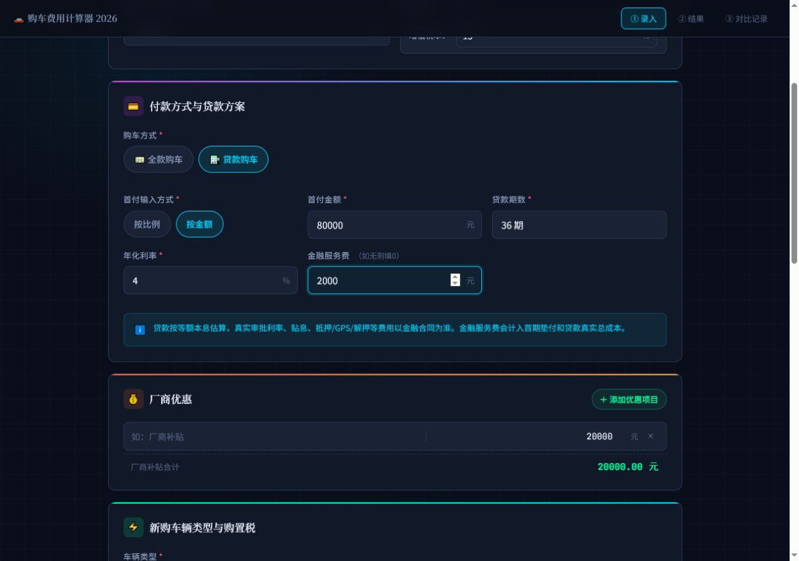
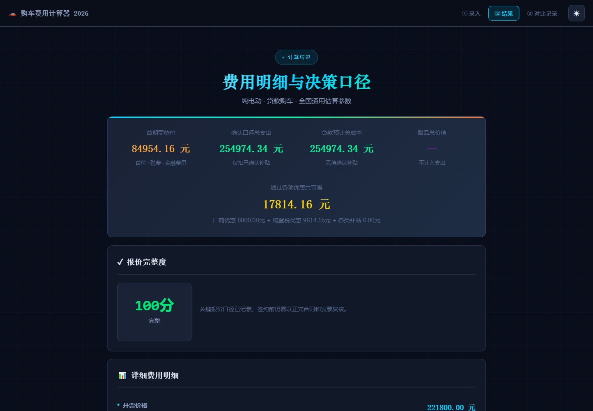
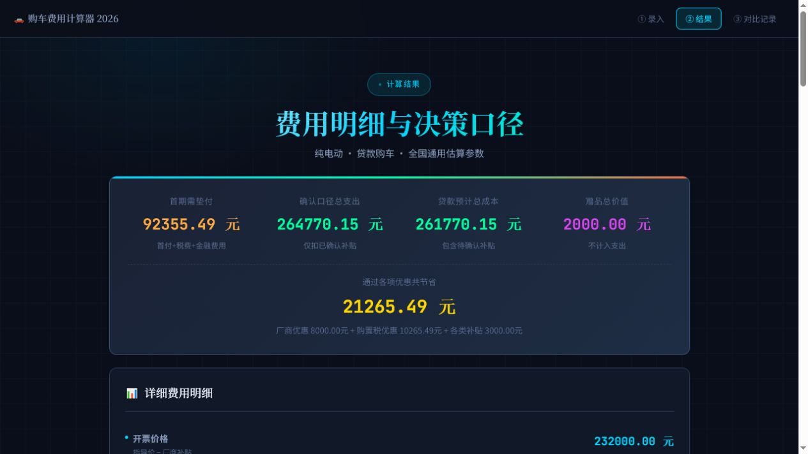
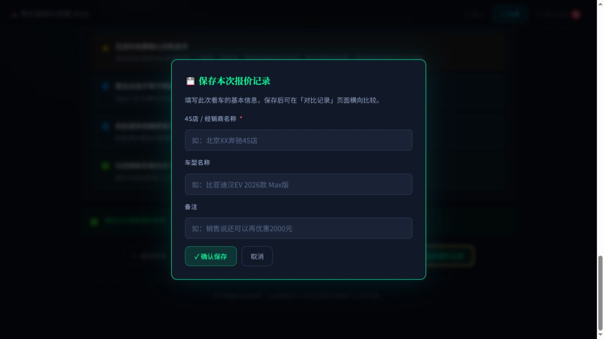

# 购车费用全维度计算器：新用户使用说明书

本文面向第一次使用本项目的购车用户。无需了解编程，也不要求掌握贷款公式。按照本文顺序录入销售报价，即可拆清费用、核对税费、比较全款和贷款方案，并保存多家经销商报价。

> 本工具用于个人预算估算和报价核对，不替代政府公告、车辆目录、税务认定、保险公司报价、金融合同、购车合同或最终发票。

## 1. 先了解三种使用方式

| 使用方式 | 推荐程度 | 普通计算 | 本地记录 | PWA 离线缓存 | OCR/二维码 | 分享链接 |
| --- | --- | --- | --- | --- | --- | --- |
| GitHub Pages 在线版 | 推荐 | 支持 | 支持 | 支持 | 资源已随 PWA 本地缓存 | 支持 |
| 本地 HTTP 服务 | 推荐 | 支持 | 支持 | `localhost` 下支持 | 使用仓库本地资源 | 仅适合本机地址，不适合发给他人 |
| 双击 `index.html` | 基础可用 | 支持 | 取决于浏览器对 `file://` 的存储策略 | 不支持 | Worker/文件权限兼容性较弱 | 不建议使用 |

在线版地址：<https://ganghaosun.github.io/car-buying-calculator/>

如果只是快速计算，可以直接使用在线版。如果希望保存本地副本，建议通过本地 HTTP 服务运行，而不是只双击 HTML 文件。

### 1.1 本地 HTTP 运行

在项目根目录启动任意静态服务器，例如：

```bash
python -m http.server 8080
```

然后在浏览器访问：

```text
http://127.0.0.1:8080/
```

### 1.2 “离线”到底指什么

项目没有业务后端，计算、报价记录和证据附件都在浏览器本地处理。OCR Worker/WASM/中英文模型、二维码、ZIP 和长图运行库都保存在仓库 `vendor/`，页面使用系统中文字体栈，不再请求公共 CDN 或在线字体。通过 GitHub Pages 或 `localhost` 首次打开并等待“PWA 离线缓存已接管”后，可断网重载并使用 OCR、二维码和报告能力。

仍需注意：

- Service Worker 只有在 HTTPS 或 `localhost` 环境工作，直接双击 HTML 不会启用。
- 直接双击 HTML 时政策 JSON 可能无法 `fetch`，页面会使用内置兜底参数。
- `file://` 下 Web Worker、下载和本地存储策略因浏览器而异。
- GitHub Pages 第一次访问仍需要网络，之后才由 PWA 缓存提供离线资源。
- 页面顶部“当前离线能力”会显示网络、本地存储、本地 OCR/二维码和 PWA 接管状态。

## 2. 看车前准备什么

建议提前建立一个手机备忘录，每家店都向销售索取或确认以下信息：

| 类别 | 需要确认的内容 |
| --- | --- |
| 车辆 | 完整车型年款、配置版本、指导价、选装项目 |
| 发票 | 预计开票价、优惠是否直接体现在发票金额中 |
| 税费 | 购置税口径、是否符合新能源车辆目录要求 |
| 保险 | 交强险、车船税、车损险、三者险、驾乘险、医保外用药等分项 |
| 店端费用 | 上牌费、金融服务费、GPS/抵押/解押费、精品包、出库费等 |
| 贷款 | 首付、期数、年化利率、月供、总还款额、厂家贴息、提前结清条款 |
| 补贴 | 国家、地方、区县、厂家、经销商补贴及到账条件 |
| 赠品 | 保养、贴膜、脚垫、充电桩等，是否写入合同 |
| 以旧换新 | 报废或置换方式、旧车登记日期、持有时间、申请材料 |

不要只记录销售给出的“最后落地价”。这个总数无法说明优惠发生在哪一项，也无法判断贷款利息、后返补贴和捆绑费用是否被隐藏。

## 3. 第一次计算：从上到下填写


### 3.1 基础价格

“新车官方指导价”填写该年款、该配置车型的官方含税指导价。不要把销售口头落地价填在这里。“车型年款、配置与选装”应尽量写完整，它是判断两家报价是否可比的关键字段。

增值税率默认使用页面政策配置中的参数。普通用户通常不需要修改；只有在明确掌握发票和税务口径时才调整。

### 3.2 全款还是贷款

全款购车只计算开票价、购置税、保险、其他费用和补贴。

贷款购车还需要填写：

| 字段 | 填写方法 | 常见误区 |
| --- | --- | --- |
| 首付输入方式 | 首付比例和首付金额二选一 | 不要同时维护两个不一致的数值 |
| 贷款期数 | 按金融方案实际期数填写 | 不要只看“月供低” |
| 年化利率 | 填合同或正式方案中的年化口径 | 月费率不等于年化利率 |
| 金融机构与方案 | 填银行、厂家金融和方案名称 | 不同方案不能只按月供比较 |
| 还款方式 | 等额本息或等额本金 | 两者首月月供和总利息不同 |
| 金融服务费 | 经销商统一收取的金融服务费 | 零利率不等于零金融成本 |
| 厂家贴息 | 厂家或金融机构实际承担的利息 | 口头贴息必须核对到账方式 |
| 金融附加费 | GPS、抵押、解押等逐项填写 | 不要重复计入金融服务费 |
| 少享全款优惠 | 填贷款价相对同口径全款价减少的现金优惠 | 这是机会成本，不是提车日现金付款 |
| 提前结清 | 填计划结清期数和违约金比例 | 以合同是否允许提前结清为准 |



页面会同时给出全款、等额本息和等额本金方案。最终比较时应看“贷款预计总成本”“综合融资成本”和“综合年化”，不能只比较首付、名义利率或月供。综合年化包含费用、放弃的全款优惠和贴息，但不替代金融机构正式披露。

### 3.3 保险费用

保险必须分项录入。建议至少拆分：

- 交强险；
- 车船税；
- 商业险中的车损险；
- 第三者责任险；
- 驾乘险；
- 医保外用药责任险；
- 销售要求捆绑的其他险种。


销售只给出一个保险总价时，可以先填总额，但对比不同门店前应要求销售补充分项、保险公司和保额，并写入“保险公司、险种与保额口径”，否则两个保险报价可能并不可比。

### 3.4 厂商优惠

这里只填写直接降低开票价的优惠，例如现金优惠或直接反映在发票金额中的厂家补贴。

以下项目不要填在厂商优惠中：

- 提车后申请的地方补贴；
- 后返现金；
- 以旧换新补贴；
- 赠品估值；
- 贷款贴息。

原因是厂商优惠会改变开票价和购置税计税基础，其他补贴通常不会。

### 3.5 车辆类型与购置税

新能源车需要继续选择纯电、插混/增程或燃料电池。燃油车需要选择排量范围。

车型是否真正符合税收优惠条件，取决于官方车辆目录和当期政策。页面只能按已配置参数估算，不能替代车型目录资格查询。

### 3.6 以旧换新

不参与换购时选择“不参与”。参与时需要区分：

- 报废更新：旧车按规定报废；
- 置换更新：旧车通过正规二手车渠道转让。

继续填写旧车类型、首次注册日期和是否在本人名下满规定时间。页面会根据政策包参数估算资格和金额，但申请结果仍以主管部门审核为准。

### 3.7 其他费用、补贴和赠品

三类项目必须分开：

| 项目 | 计入方式 | 示例 |
| --- | --- | --- |
| 其他费用 | 增加提车垫付和总支出 | 上牌费、服务费、精品包 |
| 其他补贴 | 按确认状态从对应口径扣除 | 市补、区补、店端后返 |
| 赠品 | 不减少现金支出，只降低等效支出 | 保养、贴膜、脚垫 |

补贴确认状态的含义：

- 已确认：有正式通知、合同条款或可核验凭证；
- 待申请/有条件：需要满足上牌地、申请时间、名额等条件；
- 销售口头承诺：尚未形成可执行的书面约定。

结果页会把已确认补贴和待确认补贴分开，避免把尚未到账的钱当成已经省下的钱。

### 3.8 长期持有成本

选择 3 年或 5 年后，可填写年行驶里程、每百公里能源成本、续保、保养和预计残值比例。

这部分适合比较燃油车和新能源车，或比较不同级别车型。能源价格、残值和保养费都是估算值，建议用保守、中性、乐观三套参数分别计算。

### 3.9 报价完整度核对

勾选“收费项目已逐项确认”和“补贴条件已核对”之前，应让销售明确回答是否还有强制保险、上牌、服务、金融或精品费用，并确认补贴申请期限、责任方和失败后的处理方式。“合同关键条款”建议记录订金可退条件、交付日期、车架号、赠品履行和违约责任。

这些字段不会阻止计算，但会进入 0-100 分完整度评分。分数低说明报价仍可用于初步预算，不适合直接签约或跨店比较。

## 4. 结果页怎么看



### 4.1 开票价

```text
开票价 = 指导价 - 直接影响发票金额的厂商优惠
```

### 4.2 购置税

```text
不含税价 = 开票价 ÷ (1 + 增值税率)
燃油车购置税 = 不含税价 × 购置税税率
新能源购置税 = 按政策配置计算原始税额、减免比例和封顶值
```

### 4.3 提车时或首期需垫付

全款：

```text
开票价 + 购置税 + 保险 + 其他费用
```

贷款：

```text
首付 + 购置税 + 保险 + 其他费用 + 金融附加费用
```

这个数字回答“提车当天需要准备多少钱”，不等于最终总成本。

### 4.4 确认口径与预计口径

```text
确认口径总支出 = 毛成本 - 已确认补贴
预计总支出 = 确认口径总支出 - 待确认补贴
```

签合同和准备资金时优先看确认口径；判断补贴全部到账后的理想结果时再看预计口径。

### 4.5 贷款方案和现金流

贷款结果包含：

- 全款、等额本息、等额本金横向比较；
- 首月和末月月供；
- 总利息和金融附加费用；
- 贷款相对全款少享的现金优惠；
- 厂家贴息实际抵扣；
- 综合融资成本和综合年化；
- 每期本金、利息和剩余本金；
- 提前结清的剩余本金、违约金和预计节省利息；
- 提车日和每个月的现金流时间轴。



综合融资成本的估算口径为：

```text
综合融资成本 = 总利息 + 金融附加费用 + 放弃的全款优惠 - 实际生效贴息
```

综合年化按决策口径净融资额与每期还款现金流求解。贴息按提车时等价抵扣处理，所以页面给出的是比较模型，不是银行正式还款计划或法定年化披露。签约前应与金融机构的总还款额、逐期计划和正式年化核对。

### 4.6 报价完整度

结果页显示完整度分数、等级和缺项。主要检查车型配置、保险口径、收费确认、补贴条件、合同条款，以及贷款方案和全款优惠差额。100 分表示关键字段已记录，不代表销售承诺一定真实，也不代替合同复核。

### 4.7 风险提示

风险提示用于发现常见问题，例如：

- 待确认补贴金额较大；
- 口头承诺未写入合同；
- 保险或其他费用偏高；
- 贷款附加成本较高；
- 金融服务费和其他附加费同时存在；
- 赠品估值占比较高。

风险提示不是法律结论，但可以直接转化为与销售核对的问题清单。

## 5. 保存和比较多家报价

计算完成后点击“保存报价记录”，填写经销商、车型和备注。每家店使用相同车型、相同保险保额和相同补贴口径，比较才有意义。



进入“对比记录”后可以：

- 查看按预计总支出排序的成本图；
- 标记当前最低成本方案；
- 查看每条报价详情；
- 选择 2 至 4 条报价逐项比较；
- 查看车型配置、保险和贷款条件的可比性提示；
- 点击“复制”把已有报价回填到录入页，只改新门店的差异项；
- 导出或导入结构化报价 JSON；
- 导出或恢复包含证据附件的完整 ZIP 备份；
- 导出 CSV 表格；


逐项对比时重点关注开票价、保险、其他费用、综合融资成本、补贴确认状态、完整度和风险数量。页面会检查车型配置、保险保额、全款/贷款方式和贷款条件；出现“部分项目不可直接比较”时，应先统一口径再看最低价。

## 6. 报价报告、分享链接和二维码

### 6.1 报价摘要

“复制/分享摘要”会生成适合发送给家人或朋友的纯文本摘要。支持系统原生分享的浏览器会打开分享面板，否则复制到剪贴板。

### 6.2 报价链接

报价链接把脱敏后的计算结果压缩到 URL 片段中，不经过项目服务器。经销商名称、车型备注、计算过程文本和本地证据不会写入分享数据。

注意：

- 链接可能很长；
- 链接一旦发出无法远程撤销；
- 不要在报价字段里填写手机号、身份证号或未脱敏合同内容；
- 直接双击 HTML 时不要使用此链接对外分享；
- 本地 HTTP 地址只在本机有效，跨设备分享应使用 GitHub Pages 在线版。

### 6.3 二维码

二维码适合较短的报价。报价项目和贷款现金流较多时，页面会提示数据过长，此时应改用压缩链接或 JSON 文件。

### 6.4 HTML 报价报告

“导出报价报告”会生成一个 HTML 文件，适合在浏览器中继续查看、打印或转成其他格式。

### 6.5 原生 PDF

“PDF 导出”会在浏览器本地生成 `.pdf` 文件，内容包含核心费用表、风险提示、计算过程摘要和免责声明。PDF 写入中文 ToUnicode 映射，常见阅读器中可以检索和复制文本；移动端浏览器的下载位置和文件名可能由系统接管。

### 6.6 PNG 长图

“导出长图”会在浏览器本地把同一份报告渲染成 PNG，包含报价口径、完整度、贷款成本、风险提示和计算过程。长图适合手机转发；需要可检索文本或正式分页时，优先使用原生 PDF。

## 7. OCR 辅助录入

点击“识别报价单”选择清晰图片。OCR 会尝试识别指导价、开票价、优惠、购置税、保险、金融服务费、贷款期数和年化利率。

使用原则：

- OCR 只产生候选字段；
- 写入表单前逐项核对；
- 表格复杂、字体过小、图片倾斜或反光会降低准确率；
- OCR 识别出的开票价不会直接替代计算逻辑中的优惠口径；
- 原始图片可在计算后保存为本地证据；
- OCR Worker、WASM 和中英文语言数据已保存在仓库内；PWA 缓存接管后可断网运行。

## 8. 本地证据附件

结果页可以添加报价单图片、合同照片或 PDF。文件存储在浏览器 IndexedDB，不会上传本项目服务器。

本地证据不是云备份，也不是法律意义上的电子存证：

- 清理浏览器站点数据会删除文件；
- 更换浏览器、设备或访问地址后看不到原文件；
- 普通 JSON 只保存附件引用；“完整备份”ZIP 会保存附件二进制内容和恢复清单；
- 重要合同和报价单应在文件夹、网盘或其他可靠位置另行备份。

## 9. 政策配置和城市政策包

页面默认读取 `data/policy.json`。城市政策包必须包含名称、版本、适用地区、生效日期、失效日期、核验日期和官方来源。

导入前建议核对：

- 来源是否为主管部门官方网站；
- 政策是否已经生效；
- 是否仍有申请名额或预算；
- 发票地、上牌地、户籍或社保是否有限制；
- 车型、价格和购车日期是否符合要求；
- 补贴是否允许与其他补贴叠加。

模板文件位于 `data/policy-template.json`。模板只描述结构，不代表任何城市的真实补贴金额。城市政策包维护规则见 [城市政策包维护说明](policy-pack-guide.md)，新增政策包前应运行 `npm run policy:validate`。

## 10. 数据备份和恢复

建议每次重要看车后执行一次完整 ZIP 备份。JSON 用于迁移结构化报价，CSV 主要用于表格查看和二次分析；只有 ZIP 会把 IndexedDB 证据附件一起带走。

推荐备份组合：

| 内容 | 推荐备份方式 |
| --- | --- |
| 多店报价和证据附件 | 完整 ZIP 备份 |
| 仅结构化报价 | 导出 JSON |
| 表格分析 | 导出 CSV |
| 单次完整结果 | 导出 HTML 报告并打印为 PDF |
| 报价单和合同原件 | ZIP 备份之外再单独保存 |
| 临时讨论 | 分享摘要或在线版报价链接 |

“恢复备份”会替换当前浏览器中的全部报价和证据，页面会在写入前校验清单、记录和附件大小并要求确认。恢复前仍建议导出当前完整备份作为回退。

## 11. 常见问题

### 为什么购置税不是指导价乘以 10%？

购置税通常先从含税开票价中剥离增值税，再按购置税率计算。新能源车还涉及目录资格、减免比例和封顶值。

### 为什么补贴没有从提车当天付款中扣掉？

很多补贴需要提车、上牌或提交材料后申请，所以页面把它们放在后续总支出口径中，而不是默认减少提车垫付。

### 零利率贷款为什么还可能更贵？

金融服务费、GPS、抵押费、捆绑保险、放弃现金优惠和提前结清限制都会增加实际成本。

### 赠品能否当作现金优惠？

不能。赠品只影响综合等效支出，不减少实际付款。估值应按自己真实愿意支付的价格，而不是销售标价。

### 换浏览器后记录为什么不见了？

记录和附件保存在当前浏览器、当前站点地址下。更换浏览器、端口、域名或设备会形成新的本地存储空间。

### 为什么 OCR 或二维码提示加载失败？

运行库已经本地化。请先确认通过 HTTPS 或 `localhost` 打开、页面顶部显示 PWA 缓存已接管，并检查浏览器是否禁用了 Worker、IndexedDB 或文件选择权限。直接双击 HTML 时兼容性较弱。

### 为什么双击 HTML 后无法安装到桌面？

PWA 和 Service Worker 需要 HTTPS 或 `localhost`，`file://` 环境不支持。

## 12. 功能验证状态

验证日期：2026-07-12。

| 功能 | 当前状态 | 验证方式 |
| --- | --- | --- |
| 燃油车和新能源购置税 | 已通过 | Node.js 计算核心测试 |
| 新能源减免封顶 | 已通过 | 边界公式断言 |
| 补贴确认分层和风险提示 | 已通过 | 计算核心测试 |
| 等额本息和等额本金 | 已通过 | 月供、总利息、36 期计划断言 |
| 首付比例和首付金额 | 已通过 | 计算测试与浏览器流程 |
| 厂家贴息 | 已通过 | 贴息上限、客户实际还款和页面展示 |
| 综合年化和放弃全款优惠 | 已通过 | 现金流内部收益率、费用和机会成本断言及页面展示 |
| 提前结清 | 已通过 | 剩余本金、违约金和节省利息测试 |
| 贷款方案对比和现金流 | 已通过 | 计算测试与浏览器流程 |
| 3/5 年持有成本 | 已通过核心公式 | 能源、续保、保养、残值测试 |
| 报价完整度与可比性 | 已通过 | 纯函数单元测试和两店 E2E |
| 全款和贷款页面计算 | 已通过 | Playwright Chromium/Firefox/WebKit E2E |
| 报价保存、复制和两店逐项对比 | 已通过 | Playwright Chromium/Firefox/WebKit E2E |
| JSON 旧记录迁移 | 已通过 | 版本迁移测试 |
| 压缩分享编解码 | 已通过 | 中文数据往返测试 |
| OCR 字段解析 | 已通过规则测试 | 使用模拟报价文本；真实图片精度取决于图像质量 |
| OCR 本地运行库 | 已通过运行链路 | PWA 断网后实际加载 Worker/WASM/中英文模型并返回审阅字段；识别精度仍取决于图片 |
| 二维码本地生成 | 已通过主流程 | 本地运行库，无 CDN；仍受二维码容量限制 |
| 本地证据附件 | 已通过 | E2E 上传 IndexedDB 证据并随 ZIP 备份恢复 |
| JSON/CSV/HTML/PDF/PNG 下载 | 已通过自动化 | JSON 往返、PDF 文件头/ToUnicode 和非空长图均自动验证；实际保存位置由浏览器控制 |
| 完整 ZIP 备份恢复 | 已通过 | 校验报价数量、证据数量、附件大小和恢复后引用 |
| PWA 安装和断网缓存 | 已通过 Chromium | 实际断网重载并继续运行 OCR；仍需 HTTPS 或 `localhost` |
| 手机尺寸、主题与键盘 | 已通过三引擎自动化 | 390×844 无横向溢出、主题切换、快捷计算和 Escape 弹窗 |
| Firefox/WebKit 自动化矩阵 | 已纳入 | 核心录入、计算、保存、导入导出、备份、PDF/PNG 下载和手机尺寸进入三引擎矩阵 |
| 真机兼容性 | 待人工记录 | 记录模板见 [浏览器与真机核验矩阵](browser-and-device-matrix.md) |

结论：核心计算、主要报价工作流、完整备份、PDF/长图和 Chromium PWA 离线链路已经通过自动化验证，可用于个人预算核算。不能表述为“所有浏览器、所有政策和所有真实报价图片均校验无误”；不同手机权限、真实 OCR 精度和地方政策仍需按环境核对。

## 13. 使用时的最终核对清单

签合同前至少再次确认：

- 车型年款、配置、颜色和选装是否一致；
- 开票价与合同金额是否一致；
- 每一项优惠是否说明是发票内优惠还是后返；
- 保险险种、保额和保险公司是否明确；
- 服务费、精品包、上牌费和金融附加费是否全部列出；
- 月供、期数、总还款额和实际年化利率是否一致；
- 厂家贴息的承担方、到账时间和失效条件是否写明；
- 提前结清期数、违约金和利息计算方式是否写明；
- 补贴申请条件、截止时间和材料是否可满足；
- 赠品名称、规格、数量和履行时间是否写入合同；
- 报价单、合同和补充协议是否已备份。

完成这些核对后，再用“确认口径总支出”作为签约预算，用“预计总支出”作为补贴全部兑现后的参考值。
